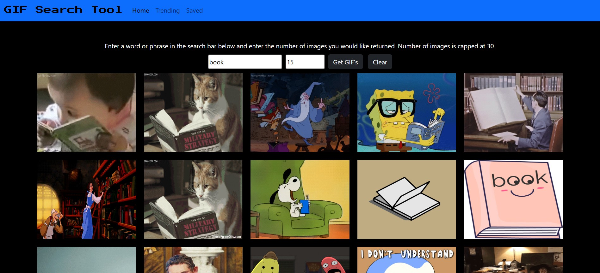
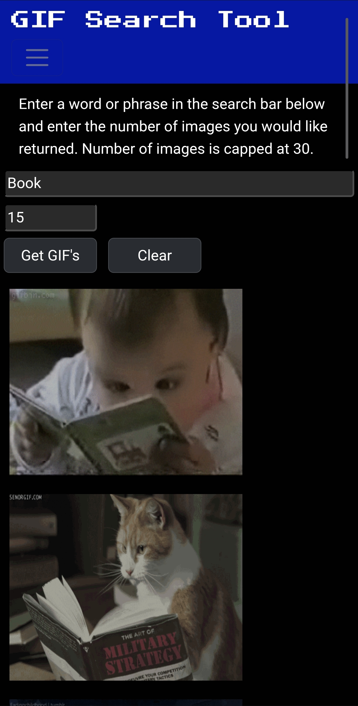

## Project Overview: 
This application allows the user to enter a word or phrase into a text box and click a button to load GIF images from Giphy. There is a paragraph containing the simple instructions for how to use the application. The application collects and displays the number of images requested by the user. Through the use of flex boxes, the application displays the returned images in a grid that scales with screen width and stays centered on the screen. There are multiple checks in place to handle errors and data outside of the intended limits. There is a clear button that removes all images from the page and also clears both of the input boxes.

https://dktomp.github.io/Project2/

## Technologies used: 
- **html**
- **javascript**
- **css**
- **boostrap**
- **giphy API**
- **async/await**

## User Stories: 
- **As a user, I want to search for GIF's, so that I can send them to someone**
 
- **As a user, I want to search for GIF's, so that I can save them to my device**

- **As a user, I want to search for GIF's, so that I can save them to a library**

## Wireframes:
 

## Screenshots:
 

## Ideas for future improvements:
- **Add a function to save GIF's to a library for future use**
- **Add more pages to browse saved GIF's**
- **Add more styling**

## Author - Dylan Tompkins
<a>www.linkedin.com/in/dylan-tompkins-24728439a</a>